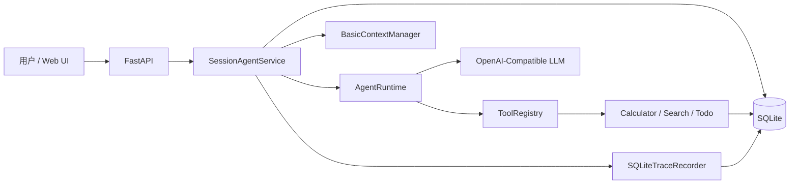

# Minimal Agent Runtime

项目名称：**Minimal Agent Runtime**

项目目标：**不依赖现有 Agent 框架，从零实现一个最小可用 Agent。**

核心特点：

- 自研 Agent Runtime Loop
- LLM 基于 Tool Schema 自主选择工具
- 支持直接回答和多工具调用
- 支持多步工具循环
- 支持真实 LLM API
- 支持多用户、多 Session 隔离
- 支持对话恢复和工具追问
- 支持 Context 基础压缩
- 支持 SQLite 持久化
- 支持 Trace 时间线
- 支持 Web 多窗口操作
- 支持异常、并发与安全测试

GitHub：[https://github.com/ssqq0330/minimal-agent-runtime](https://github.com/ssqq0330/minimal-agent-runtime)

## 1. 项目简介

Minimal Agent Runtime 是一个教学与验收导向的最小 Agent 系统。项目不使用 LangChain、LangGraph、OpenAI Agents SDK 等 Agent 框架，而是直接用 Python 实现 LLM 决策、JSON 协议解析、工具调度、多步循环、Session Memory、Context 压缩和 Trace。后端使用 FastAPI，持久化使用 SQLite，前端使用原生 HTML/CSS/JavaScript。

模型每一步只能返回两类结构化决策：`final` 表示直接回答，`tool_call` 表示调用一个或多个工具。Runtime 执行真实工具结果并回传给模型，直到得到 `final` 或达到 `max_steps`。

## 2. 题目要求完成情况

| 题目要求 | 实现方式 | 主要文件 | 状态 |
| --- | --- | --- | --- |
| 从零实现 Runtime | 自研 `AgentRuntime` 循环 | `app/agent/runtime.py` | 已完成 |
| 不使用 Agent 框架 | 依赖与仓库审计 | `requirements.txt`、`scripts/repository_audit.py` | 已完成 |
| 直接回复或调用工具 | `AgentDecision` 的 `final/tool_call` 协议 | `app/agent/parser.py` | 已完成 |
| 三个工具 | calculator、Mock search、todo | `app/tools/calculator.py`、`app/tools/mock_search.py`、`app/tools/todo.py` | 已完成 |
| 工具注册与 Schema | `ToolRegistry`、`BaseTool` | `app/tools/registry.py`、`app/tools/base.py` | 已完成 |
| LLM 自主调用 | System Prompt 注入 Tool Schema | `app/agent/prompts.py` | 已完成 |
| 输出解析 | JSON 提取、字段与互斥规则校验 | `app/agent/parser.py` | 已完成 |
| 多 Session | `user_id + session_id` 联合范围 | `app/memory/store.py` | 已完成 |
| 持续对话与追问 | `SessionAgentService` 召回历史 | `app/agent/session_service.py` | 已完成 |
| Context 管理 | `BasicContextManager` | `app/memory/context.py` | 已完成 |
| 最大轮次 | `AgentRuntime.max_steps` | `app/agent/runtime.py` | 已完成 |
| 异常处理 | 分类异常与 API 映射 | `app/api/errors.py` | 已完成 |
| Trace | `agent_runs`、`trace_events` | `app/observability/trace.py`、`app/memory/store.py` | 已完成 |
| 测试用例 | pytest 单元、集成、API、端到端测试 | `tests/` | 已完成 |
| 真实 LLM API | OpenAI-Compatible HTTP Client | `app/llm/client.py` | 已完成 |
| 网页操作 | 原生多 Session Web UI | `web/` | 已完成 |
| Prompt 记录 | Stage 01～11 记录 | `docs/AI_PROMPTS.md` | 已完成 |
| 问题记录 | 统一问题解决记录 | `docs/PROBLEM_SOLVING.md` | 已完成 |

## 3. 功能演示

推荐使用三个 Session：

1. `weather-window`：输入“请查询东京天气，并把‘出门带伞’添加到当前会话的待办中。”，观察一次决策中的 search + todo 多工具调用。
2. `report-window`：输入“请把‘周五前完成周报’添加到当前会话的待办中。”，切换窗口验证消息、Todo 和 Trace 隔离。
3. `calculator-window`：输入“请计算 12 * (3 + 2)。”，在 Trace 中查看 `calculator` 结果 `60` 与后续 `final`。

随后刷新页面或重启服务，重新进入原 Session 验证 SQLite 历史恢复。完整镜头顺序见 [录屏脚本](docs/RECORDING_SCRIPT.md)。Search 使用本地 Mock 知识库，不是实时互联网搜索。

## 4. 系统架构



FastAPI 只负责 HTTP 契约与服务装配；`SessionAgentService` 负责有状态的一轮 Chat；`AgentRuntime` 保持不依赖 SQLite；Tool Registry 保持不依赖 Agent 框架。详细模块、数据流与安全边界见 [系统设计](docs/SYSTEM_DESIGN.md)。

## 5. Agent Runtime Loop

```text
System Prompt + Tool Schema + Session Context + 当前输入
                         ↓
              OpenAI-Compatible LLM
                         ↓
                 JSON AgentDecision
                 ├─ final → 返回答案
                 └─ tool_call
                         ↓
              ToolRegistry 顺序执行
                         ↓
               真实 ToolResult 回传
                         └────────→ 下一步 LLM 决策
```

每一步都会保留模型原始结构化决策用于本轮继续，但对外只暴露最终自然语言回答和安全统计。工具失败会作为真实 `ToolResult` 回传，使模型可修正参数或解释失败。默认 `max_steps=8`，模型始终不返回 `final` 时抛出受控异常，不会无限循环。

## 6. 工具注册机制

`BaseTool` 定义 `name`、`description`、`parameters_schema`、`execute()` 与通用参数校验。`ToolRegistry` 负责注册、Schema 汇总、名称查找、顺序执行和异常转换。

- `calculator`：使用 Python AST 白名单解析，不使用 `eval/exec`。
- `search`：查询本地静态知识库，响应明确标记 `source: mock`。
- `todo`：支持 add/list/complete/delete；生产服务通过 SQLite 按 Session 持久化。

LLM 看到的是 Registry 生成的 Tool Schema，由模型自主决定是否调用、调用哪个工具以及参数；应用代码不通过关键词硬编码工具路由。

## 7. Session 与 Memory

Session 的隔离键是 `(user_id, session_id)`。消息、Todo 和 Trace 的读取与写入都携带这两个字段，因此同一用户的两个窗口互不影响，不同用户即使使用相同 `session_id` 也互不影响。

Memory 在每次 `SessionAgentService.chat()` 开始时召回：先验证 Session，再从 SQLite 读取该 Session 的自然语言历史，应用 `history_limit`，交给 Context Manager，最后才传给 Runtime。只有 Runtime 成功返回 `final` 后，当前 user 消息和 assistant 最终回答才由 `add_exchange` 在同一事务中原子写入；失败不会保存半轮对话。

详细的“召回时机与 Context 放置方式”见 [Memory 设计](docs/MEMORY_DESIGN.md)。

## 8. Context 管理与压缩

`BasicContextManager` 使用确定性的字符近似预算，而不是模型专用 Tokenizer。默认配置：

| 参数 | 默认值 | 含义 |
| --- | ---: | --- |
| `max_messages` | 20 | 超过时触发压缩 |
| `recent_messages` | 8 | 尽量原样保留的最近消息数 |
| `max_chars` | 12000 | Context 历史近似字符预算 |
| `summary_max_chars` | 4000 | 较早历史摘要上限 |
| `per_message_chars` | 500 | 摘要中单条消息上限 |

较早消息被规则化为一个 `【较早会话摘要】`，最近消息尽量完整保留。摘要只在当前调用内存在，不写回数据库，因此不会污染完整历史或产生递归摘要。

## 9. Trace 与执行日志

每轮 Chat 创建独立 `run_id`，`agent_runs` 保存生命周期与统计，`trace_events` 按递增 `sequence` 保存：

```text
run_started → context_built → llm_decision
            → tool_call → tool_result（可重复）
            → llm_decision → run_completed | run_failed
```

Trace 记录工具名称、参数、清洗后的结果、简短 `reasoning_summary` 与 Context 统计；不记录 API Key、Authorization、系统 Prompt、原始 HTTP 响应或完整隐藏思维链。Trace 用于调试和 UI 展示，从不召回进后续 LLM Context。

## 10. Web UI

访问 [http://127.0.0.1:8000/](http://127.0.0.1:8000/) 可使用原生 Web UI：

- 创建、重命名、切换、清空和删除 Session；
- 多 Session 聊天与历史恢复；
- 查看当前 Session 的 Todo；
- 查看并删除 Trace，展开工具参数与结果；
- 查看 LLM/工具调用次数和 Context 压缩统计；
- 响应式 Session/Inspector 抽屉。

前端只把演示用 user id、当前 Session 与面板偏好写入 `localStorage`，聊天、Todo、Trace 始终从后端读取。动态内容使用 `textContent`/DOM 节点和安全的轻量 Markdown 渲染，不使用 `innerHTML` 执行模型内容。user id 只是隔离演示标识，不是登录鉴权。

## 11. API 接口

| 方法 | 路径 | 用途 |
| --- | --- | --- |
| GET | `/api/health` | 健康、LLM 配置与数据库状态 |
| POST | `/api/sessions` | 创建 Session |
| GET | `/api/sessions` | 列出用户 Sessions |
| GET / PATCH / DELETE | `/api/sessions/{session_id}` | 查询、改名、删除 Session |
| GET / DELETE | `/api/sessions/{session_id}/messages` | 查询或清空消息 |
| GET | `/api/sessions/{session_id}/todos` | 查询 Session Todo |
| POST | `/api/chat` | 执行一轮 Agent Chat |
| GET | `/api/traces` | 查询 Trace Runs |
| GET / DELETE | `/api/traces/{run_id}` | 查询详情或删除 Trace |

完整参数、请求/响应与错误示例见 [API Reference](docs/API_REFERENCE.md)。服务启动后也可访问 [http://127.0.0.1:8000/docs](http://127.0.0.1:8000/docs) 查看 FastAPI 自动文档。

## 12. 项目目录

```text
minimal-agent-runtime/
├── app/
│   ├── agent/          # Parser、Prompt、Runtime、Session 服务与锁
│   ├── api/            # Chat、Session、Trace 路由与错误映射
│   ├── llm/            # OpenAI-Compatible HTTP Client
│   ├── memory/         # SQLite Store 与 Context Manager
│   ├── models/         # Pydantic HTTP Schema
│   ├── observability/  # Trace Recorder 与数据清洗
│   ├── tools/          # BaseTool、Registry、calculator/search/todo
│   ├── dependencies.py # 服务组合根
│   ├── main.py         # FastAPI 应用与静态文件挂载
│   └── security.py     # 错误与敏感信息清洗
├── web/                # 原生 HTML/CSS/JavaScript UI
├── tests/              # 单元、集成、API、端到端与安全测试
├── scripts/            # Demo、仓库/文档审计与最终验收
├── docs/               # 设计、API、Prompt、问题与提交材料
├── requirements.txt
└── README.md
```

目录树不包含本机 `.venv`、私有 `.env` 和运行时数据库文件。

## 13. 环境安装

建议 Python 3.11；代码保持 Python 3.10 兼容。

Mac / Linux：

```bash
git clone https://github.com/ssqq0330/minimal-agent-runtime.git
cd minimal-agent-runtime
python3.11 -m venv .venv
source .venv/bin/activate
python -m pip install -r requirements.txt
cp .env.example .env
python -m uvicorn app.main:app --reload
```

Windows CMD：

```cmd
git clone https://github.com/ssqq0330/minimal-agent-runtime.git
cd minimal-agent-runtime
python -m venv .venv
.venv\Scripts\activate
python -m pip install -r requirements.txt
copy .env.example .env
python -m uvicorn app.main:app --reload
```

浏览器：[http://127.0.0.1:8000/](http://127.0.0.1:8000/)

API 文档：[http://127.0.0.1:8000/docs](http://127.0.0.1:8000/docs)

## 14. LLM 配置

复制 `.env.example` 为私有 `.env` 后填写：

```dotenv
LLM_API_KEY=your_api_key
LLM_BASE_URL=https://example.com/v1
LLM_MODEL=example-model
LLM_TIMEOUT_SECONDS=60
LLM_TEMPERATURE=0
```

以上都是占位符，不可直接用于真实请求。项目支持 OpenAI-Compatible Chat Completions API；不同服务商的 `base_url` 与模型名称可能不同。不要提交 `.env`，API Key 只由后端读取并放入服务端请求头，不会发送到 Web 前端。缺少或无效配置时服务以降级模式启动，`/api/health` 与数据库/UI 接口仍可用，`POST /api/chat` 返回 HTTP 503 `llm_unavailable`。

## 15. 启动方式

```bash
source .venv/bin/activate
python -m uvicorn app.main:app --reload
```

默认数据库是 `data/agent.db`，应用首次启动时自动创建表。Chat 不会隐式创建 Session，须先在 Web UI 或 `POST /api/sessions` 创建。

## 16. 测试方式

确定性测试使用 Fake LLM 或 `httpx.MockTransport`，不读取真实密钥、不访问真实网络，也不消耗真实 API：

```bash
python -m pytest -q
python -m scripts.repository_audit
python -m scripts.documentation_audit
```

配置 `.env` 后，以下脚本调用真实 LLM：

```bash
python -m scripts.llm_smoke_test
python -m scripts.agent_runtime_demo
python -m scripts.session_memory_demo
python -m scripts.context_compression_demo
python -m scripts.trace_demo
python -m scripts.final_acceptance
```

真实模型输出存在轻微非确定性；`LLM_TEMPERATURE` 默认设为 `0` 以增强稳定性。测试层次与范围见 [Test Plan](docs/TEST_PLAN.md)。

## 17. 最终验收

发布前按顺序运行：

```bash
python -m pytest -q
python -m scripts.repository_audit
python -m scripts.documentation_audit
python -m scripts.final_acceptance
```

前三项完全离线；`final_acceptance` 使用真实 LLM 和专用的忽略数据库 `data/final-acceptance.db`，验证 API 可达、Runtime、多工具、Session/User 隔离、历史召回、Context 压缩、Trace 与重启持久化。最终人工项见 [提交清单](docs/SUBMISSION_CHECKLIST.md) 和 [Web UI 清单](docs/WEB_UI_CHECKLIST.md)。

## 18. 安全设计

- calculator 使用 AST 允许列表，拒绝变量、函数、属性、下标和导入。
- 所有 SQL 使用参数绑定；Session 数据始终带 `user_id + session_id`。
- Tool 参数执行前进行类型、必填、枚举、范围和额外字段校验。
- API 返回固定错误类别，不回显异常堆栈、Provider 响应或凭据。
- Trace 递归清洗敏感键、Bearer 值和过长字符串。
- 前端以 DOM 文本节点渲染不可信内容，避免 XSS。
- 同一进程内，同一 Session 的 Chat 由 Session 锁串行化。
- `.env`、`.venv` 与数据库文件由 `.gitignore` 排除，并由仓库审计检查。

这些措施是最小项目的防护，不等同于生产级认证、渗透测试或合规审计。

## 19. 已知限制

- user id 是演示隔离标识，不是认证授权系统。
- Session Chat 锁只在单 Python 进程生效，不支持多 Worker 分布式互斥。
- Search 是 Mock，不提供实时互联网结果。
- Context 使用字符估算与规则摘要，可能丢失较早细节。
- SQLite 不适合高并发、多机生产部署。
- Provider 对 JSON 协议的遵循程度存在差异。
- Web UI 只实现轻量安全 Markdown，Todo 面板以读取为主。

详见 [Known Limitations](docs/KNOWN_LIMITATIONS.md)。

## 20. 开发记录

- [AI Prompt 记录](docs/AI_PROMPTS.md)：Stage 01～11 的目标、Prompt、生成内容和人工检查结果。
- [问题解决记录](docs/PROBLEM_SOLVING.md)：环境、协议、隔离、并发、安全与迁移问题。
- [系统设计](docs/SYSTEM_DESIGN.md)
- [Memory 设计](docs/MEMORY_DESIGN.md)
- [API Reference](docs/API_REFERENCE.md)
- [最终项目报告](docs/FINAL_PROJECT_REPORT.md)
- [录屏脚本](docs/RECORDING_SCRIPT.md)

## 21. GitHub 链接

最终代码仓库：[https://github.com/ssqq0330/minimal-agent-runtime](https://github.com/ssqq0330/minimal-agent-runtime)

提交前请先确认远端可访问、主分支为预期版本、工作区只包含本阶段材料且没有密钥或数据库；本项目不会由验收脚本自动执行 `git commit` 或 `git push`。
