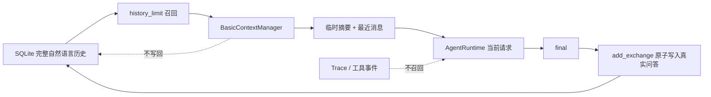

# Memory 与 Context 设计

本文专项说明 Memory 的分类、写入与召回时机，以及哪些内容会放入 LLM Context。

## 1. Memory 分类

当前实现：

- **Session Memory**：SQLite `messages` 表中的 user/assistant 自然语言对话。
- **Tool State**：SQLite 中按 Session 持久化的 Todo。
- **Trace Memory**：`agent_runs` 和 `trace_events`，只用于调试、验收和 UI 展示。
- **Context Summary**：`BasicContextManager` 在单次 Chat 内临时生成的较早历史摘要，不写回数据库。

当前未实现：

- 用户画像式长期 Memory；
- 向量数据库或 Embedding 语义召回；
- 跨 Session 自动记忆；
- 基于 LLM 的长期事实提取。

## 2. Memory 写入时机

一轮 Chat 的当前输入不会在 Runtime 前提前保存。只有 `AgentRuntime` 成功返回 `final` 后，`SessionAgentService` 才调用 `SQLiteStore.add_exchange()` 写入：

1. 当前 user 自然语言消息；
2. assistant 最终自然语言回答及紧凑统计 metadata。

`add_exchange` 在同一 SQLite 事务中插入两条消息并更新 Session 时间。任一步失败都会回滚，因此不会形成半轮对话。Runtime 因配置、网络、解析、工具循环或最大步数失败时，不保存当前 user/assistant 消息；失败过程只进入独立 Trace。

Todo 的写入发生在本轮 Runtime 的真实 `todo` 工具执行时，范围始终是当前 `ToolContext(user_id, session_id)`。因此极端情况下后续 LLM 失败，已经成功提交的工具状态可能保留，而 Chat exchange 不保存；这是工具副作用与对话原子事务边界不同的已知语义。

## 3. Memory 召回时机

每次 `SessionAgentService.chat()` 开始时，在同一 Session 锁内执行：

```text
校验 user_id / session_id / user_input
  → 检查 (user_id, session_id) Session 存在
  → 创建 Trace run
  → 从 SQLite 读取当前 Session 历史
  → 应用 history_limit 数据库召回上限
  → BasicContextManager.build(history)
  → 得到最终 history
  → AgentRuntime.run(current input, history, ToolContext)
```

当前用户输入不在召回历史中，而是由 Runtime 在处理后的 history 之后追加一次，避免重复。`history_limit` 是数据库读取窗口；Context Manager 的阈值是对该窗口的请求级压缩，两者不删除 SQLite 完整历史。

## 4. 放入 LLM Context 的内容

放入：

- Runtime 生成的 system Prompt；
- 当前 Registry 的 Tool Schema；
- 必要时生成的一条较早历史摘要；
- 最近 user 自然语言消息；
- 最近 assistant 最终自然语言回答；
- 当前用户输入；
- 本次 Runtime Loop 内产生的真实工具结果；
- 本轮模型此前返回的结构化 Agent 决策，用于继续同一 Loop。

不放入：

- 其他用户或其他 Session 的消息；
- `MessageRecord.id`、数据库行 id；
- `user_id/session_id` 数据库字段本身；
- Message metadata；
- 历史 `reasoning_summary`；
- 历史工具调用 JSON 与历史工具结果原文；
- 历史 Trace 事件；
- HTTP Authorization、API Key；
- Provider 原始 HTTP 响应；
- 完整隐藏思维链。

注意区分“历史”与“本轮”：历史只召回自然语言 user/final assistant；本轮工具调用、真实结果和结构化决策必须暂时保留，才能完成多步 Runtime Loop，但在轮次结束后不作为下一轮历史召回。

## 5. 为什么这样设计

- 防止 Context 随 Session 历史无限增长；
- 避免过期或很长的历史工具结果干扰新一轮工具选择；
- 用户续聊主要依赖可见的自然语言问题与最终答案；
- Trace 面向调试，Context 面向模型决策，两者生命周期和最小披露原则不同；
- 数据库保存完整自然语言历史，单次模型请求只放必要内容；
- 临时摘要不写回，避免合成文本成为事实来源或产生嵌套摘要；
- metadata 只保存统计而不参与召回，便于观测且不污染 Prompt。

## 6. Session 隔离

联合范围是：

```text
user_id + session_id
```

这意味着：

- 同一用户的两个窗口互不影响；
- 不同用户使用相同 `session_id` 也互不影响；
- Message、Todo、Trace 和 Session Chat 锁遵守同一范围；
- 前端切换窗口后重新按当前二元范围请求数据。

SQLite 的联合主/外键和每条查询的双条件提供数据层隔离。Web UI 的 user id 仍只是演示标识，没有登录认证与访问令牌，不能当作互联网环境中的授权机制。

## 7. Context 压缩

默认配置：

| 参数 | 默认值 | 作用 |
| --- | ---: | --- |
| `max_messages` | 20 | 归一化历史超过此数量则压缩 |
| `recent_messages` | 8 | 压缩时保留的最近原始消息数 |
| `max_chars` | 12000 | 输出历史的近似字符预算 |
| `summary_max_chars` | 4000 | 合成摘要的最大字符数 |
| `per_message_chars` | 500 | 每条较早消息进入摘要的上限 |

`max_messages` 或 `max_chars` 任一超限即触发压缩。算法先归一化 role/content，再将较早消息按时间顺序生成规则摘要，最近消息尽量原样保留；仍超预算时先缩短摘要，再从较旧的近期消息开始缩短，以保护最新上下文。

字符数只是跨 Provider、无额外依赖的近似值，不等于精确 Token。规则摘要确定、快速、可离线测试，但不理解语义重要性，可能丢失细节。更精确的 Tokenizer、语义摘要与向量召回属于后续改进。

## 8. Context 与持久化关系


