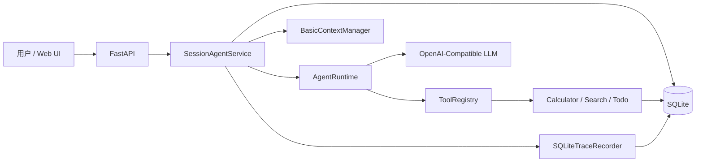
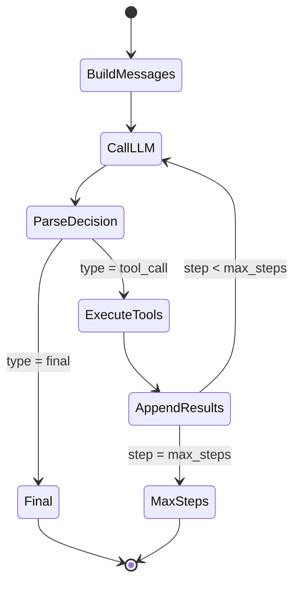
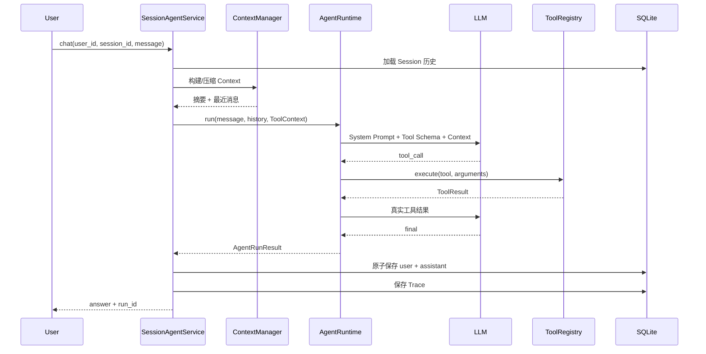

# 系统设计

## 1. 总体架构

Minimal Agent Runtime 采用分层、显式依赖注入的单体结构。Web UI 只调用 FastAPI；API 通过 `ApplicationServices` 获得 Store、Context、Runtime 和 Trace；`SessionAgentService` 编排一次有状态 Chat；`AgentRuntime` 只处理 LLM 与工具循环，不直接访问 SQLite。



## 2. 模块职责

| 模块 | 职责 | 主要文件 |
| --- | --- | --- |
| 应用组合根 | 创建、持有和关闭服务依赖；无 LLM 配置时降级启动 | `app/dependencies.py`、`app/main.py` |
| HTTP API | Pydantic 校验、路由、响应 Schema、异常映射 | `app/api/`、`app/models/schemas.py` |
| Session 编排 | 召回、Context、Runtime、原子保存、Trace、Session 锁 | `app/agent/session_service.py` |
| Runtime | 构建消息、调用 LLM、解析决策、执行工具、多步终止 | `app/agent/runtime.py` |
| 决策协议 | `final/tool_call` JSON 提取与严格校验 | `app/agent/parser.py`、`app/agent/prompts.py` |
| LLM Client | 直接调用 OpenAI-Compatible Chat Completions HTTP API | `app/llm/client.py` |
| Tool 系统 | Schema、参数校验、注册与执行 | `app/tools/` |
| Memory | Session、Message、Todo、Trace 的 SQLite 持久化 | `app/memory/store.py` |
| Context | 历史归一化、字符预算、规则摘要和近期保留 | `app/memory/context.py` |
| Observability | Run/Event 生命周期、序号、清洗和查询 | `app/observability/trace.py` |
| Web | 多 Session 聊天、Todo 与 Trace Inspector | `web/` |

精简目录：

```text
app/
  agent/          Runtime、Parser、Prompt、Session Service、Session Lock
  api/            Session、Chat、Trace API 与异常映射
  llm/            OpenAI-Compatible Client
  memory/         SQLite Store 与 Context Manager
  models/         HTTP Schema
  observability/  Trace Recorder
  tools/          Base、Registry、calculator、Mock search、todo
web/              原生前端
tests/            自动测试
scripts/          演示、审计与最终验收
docs/             设计与提交材料
```

## 3. Agent Runtime Loop

`AgentRuntime.run()` 接收当前输入、已处理的历史和 `ToolContext`。它先生成包含 Tool Schema 的 system Prompt，再按 `system → history → current user` 排列消息。每个 step 调用一次 LLM，并用 Parser 得到互斥决策：

- `final`：要求非空 `answer` 且不允许工具调用，立即形成 `AgentRunResult`。
- `tool_call`：要求至少一个带唯一 id 的调用，不允许同时给出 answer。

多个工具调用按模型给出的列表顺序执行。每个真实 `ToolResult` 通过结构化 user 消息返回 LLM，随后进入下一 step。工具失败不是 Runtime 崩溃条件，而是供模型修正或解释的真实输入。循环最多执行 `max_steps` 次，默认值为 8。



## 4. 工具注册与执行

`BaseTool` 提供统一 Schema 和轻量 JSON-Schema 风格参数校验。`ToolRegistry` 以名称保存工具，拒绝重复注册，并将未知工具或内部异常转换为 `ToolResult(success=false)`。默认 Registry 注册：

- `calculator`：AST 白名单安全计算；
- `search`：本地 Mock 知识库；
- `todo`：add/list/complete/delete，生产图中注入 SQLite Store。

Runtime 只依赖 Registry 接口，不依赖具体工具。`ToolContext(user_id, session_id)` 原样传到每次执行，使有状态工具遵守同一隔离边界。

## 5. Session 与数据隔离

Session 主键是 `(user_id, session_id)`。messages、todos、todo_counters、agent_runs 通过同一联合范围关联；所有查询都绑定参数而不是拼接 SQL。其效果是：

- 同一用户的多个浏览器窗口拥有独立消息、Todo 和 Trace；
- 不同用户可以使用相同 `session_id` 而不共享数据；
- 删除 Session 通过外键级联删除关联消息、Todo、计数器、Runs 和 Events。

`SessionLockManager` 也使用相同二元 key。同一进程内，同一 Session 的完整 Chat 串行执行；不同 Session/用户仍可并行。该锁不跨进程，因此生产多 Worker 不在当前保证范围内。

## 6. Context 构建

一次 Chat 的顺序固定为：验证身份字段与 Session → 按范围读取消息 → 应用 `history_limit` → `BasicContextManager.build()` → 把结果传入 Runtime。Context Manager 仅复制 `role/content`，忽略 Message id、metadata 和历史 Agent 统计。

历史超过 `max_messages` 或 `max_chars` 时，较早内容生成确定性 `【较早会话摘要】`，最近 `recent_messages` 条尽量保持原文。摘要只存在于本次调用内，不写回 SQLite。数据库因此保存完整事实来源，模型请求只接收必要窗口。

## 7. Trace 生命周期

Trace 在 Session 验证后、Context 构建前开始。成功和失败都应形成终态：



`agent_runs` 保存状态、起止时间、边界化输入/答案、错误类别和调用统计。`trace_events` 用逐 Run 的 `sequence` 保存 `run_started`、`context_built`、`llm_decision`、`tool_call`、`tool_result` 和终态。Trace 与消息是不同的数据用途，Trace 不进入 Context。

## 8. API 与前端

FastAPI 挂载 `/api/sessions`、`/api/chat`、`/api/traces` 与 `/api/health`，同时在 `/` 和 `/static` 提供原生前端。Pydantic 负责请求长度和类型校验，domain exception 在 `app/api/errors.py` 映射为稳定的 `{error:{code,message}}`。

前端 `api.js` 封装 HTTP，`state.js` 管理内存状态，`app.js` 编排交互，`inspector.js` 处理 Todo/Trace，`render.js` 以 DOM 节点安全呈现文本。历史、Todo、Trace 请求使用 AbortController/版本号/归属快照避免旧响应覆盖当前 Session。

## 9. 异常处理

系统按边界分类错误：配置、网络请求、Provider 响应、Agent 输入、决策解析、最大步数、Context、Memory、Trace。Runtime 将 LLM 层错误转换为 Agent 层类别；Tool Registry 把工具异常变成失败结果；API 再映射为 4xx/5xx 固定错误。

Chat 只有在 Runtime 返回 final 后才调用 `add_exchange`，两条消息同事务写入。若 Context、LLM、Parser、Runtime 或 Store 失败，Trace 尝试写入 `run_failed`，原异常继续上抛；不会留下只有 user 没有 assistant 的半轮消息。

## 10. 安全边界

- 密钥只从后端 `.env` 读取并进入 LLM Authorization 请求头；不进入前端。
- API 错误不回显异常详情，`sanitize_error_message` 过滤凭据形式。
- Trace 递归屏蔽敏感 key、Bearer token、系统 Prompt、原始响应和隐藏 reasoning。
- Calculator 使用 AST 白名单，禁止动态代码执行。
- SQLite 查询使用参数绑定；输入长度与 Tool 参数均有验证。
- Web 不用 `innerHTML` 渲染动态内容，轻量 Markdown 基于文本节点。
- user id 不是真实身份认证；单进程锁也不是分布式并发控制。这两点是明确限制，不应被当成生产安全保证。
